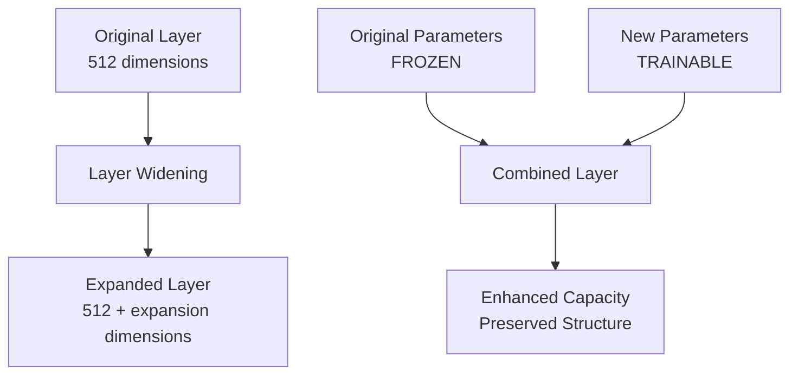
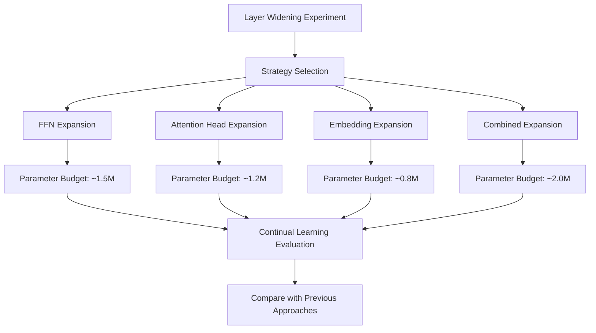
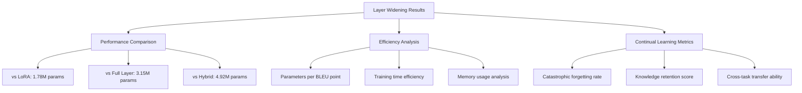

# Layer Widening Continual Learning Experiment Proposal

**Experiment Type**: Parameter-Efficient Continual Learning  
**Approach**: Layer Widening / Parameter Expansion  
**Proposed Date**: May 2025  
**Status**: Proposal Phase  

## Executive Summary

This proposal outlines a novel approach to parameter-efficient continual learning called **"Layer Widening"** or **"Parameter Expansion"**. Instead of adding new layers (Full Layer approach) or low-rank adaptations (LoRA), this method expands the width of existing transformer layers by adding new trainable parameters while keeping original parameters frozen.

**Key Innovation**: Expand model capacity by widening existing layers rather than deepening or adapting them.

---

## Background and Motivation

### Current Approaches Comparison

Based on previous experiments, we have established three successful continual learning approaches:

| Approach | Parameters | Performance | Key Benefit |
|----------|------------|-------------|-------------|
| **LoRA** | 1.78M (2.8%) | Good | Most parameter-efficient |
| **Full Layer** | 3.15M (4.9%) | Moderate | Negative forgetting (positive transfer) |
| **Hybrid** | 4.92M (7.7%) | **Best** | Superior overall performance |

### Research Gap

**Missing Approach**: Direct expansion of existing layer capacity without architectural changes or low-rank constraints.

**Hypothesis**: Layer widening could provide a middle ground between LoRA's efficiency and Full Layer's capacity, potentially offering:
- Better parameter efficiency than Full Layer addition
- More direct capacity expansion than LoRA
- Maintained gradient flow through original pathways
- Architectural consistency with base model

---

## Technical Approach

### Core Concept



### Implementation Strategies

#### **Strategy 1: Dimension Expansion**
Expand layer output dimensions by concatenating new trainable parameters.

```python
class ExpandedLinear(nn.Module):
    def __init__(self, original_layer, expansion_size):
        super().__init__()
        self.original_layer = original_layer  # Frozen
        self.expansion = nn.Linear(
            original_layer.in_features, 
            expansion_size, 
            bias=False
        )  # Trainable
        
    def forward(self, x):
        original_out = self.original_layer(x)  # [batch, seq, 512]
        expanded_out = self.expansion(x)       # [batch, seq, expansion_size]
        return torch.cat([original_out, expanded_out], dim=-1)
```

#### **Strategy 2: Parallel Expansion**
Add parallel trainable paths with residual connections.

```python
class ParallelExpansion(nn.Module):
    def __init__(self, original_layer, expansion_size):
        super().__init__()
        self.original_layer = original_layer  # Frozen
        self.expansion = nn.Linear(
            original_layer.in_features,
            original_layer.out_features,
            bias=False
        )  # Trainable - same dimensions as original
        
    def forward(self, x):
        original_out = self.original_layer(x)
        expanded_out = self.expansion(x)
        return original_out + expanded_out  # Residual connection
```

#### **Strategy 3: Attention Head Expansion**
Add new attention heads while keeping original heads frozen.

```python
class ExpandedMultiHeadAttention(nn.Module):
    def __init__(self, original_mha, num_new_heads):
        super().__init__()
        self.original_mha = original_mha  # Frozen
        self.new_heads = nn.MultiheadAttention(
            embed_dim=original_mha.embed_dim,
            num_heads=num_new_heads,
            batch_first=True
        )  # Trainable
        
    def forward(self, x):
        orig_out, _ = self.original_mha(x, x, x)
        new_out, _ = self.new_heads(x, x, x)
        return orig_out + new_out  # Or concatenate
```

#### **Strategy 4: FFN Width Expansion**
Expand feed-forward network intermediate dimensions.

```python
class ExpandedFFN(nn.Module):
    def __init__(self, original_ffn, expansion_size):
        super().__init__()
        self.original_ffn = original_ffn  # Frozen
        
        # Add expansion to intermediate layer
        self.expansion_up = nn.Linear(512, expansion_size)
        self.expansion_down = nn.Linear(expansion_size, 512)
        self.activation = nn.GELU()
        
    def forward(self, x):
        original_out = self.original_ffn(x)
        
        # Parallel expansion path
        expanded = self.expansion_up(x)
        expanded = self.activation(expanded)
        expanded = self.expansion_down(expanded)
        
        return original_out + expanded
```

---

## Experimental Design

### Research Questions

1. **Efficiency**: Is layer widening more parameter-efficient than existing methods?
2. **Performance**: Can it match or exceed LoRA/Full Layer performance?
3. **Continual Learning**: How does it handle catastrophic forgetting?
4. **Scalability**: How does performance scale with expansion size?
5. **Combination**: Can it be combined with LoRA for hybrid approaches?
6. **Strategy Comparison**: Which widening strategy works best?

### Experimental Framework



### Proposed Experiments

#### **Experiment 1: FFN Expansion (Primary)**
- **Strategy**: Expand feed-forward network intermediate dimensions
- **Expansion Size**: 512 additional dimensions (25% increase)
- **Parameter Count**: ~1.5M parameters (2.4% of model)
- **Rationale**: Simplest to implement, direct capacity increase

#### **Experiment 2: Attention Head Expansion**
- **Strategy**: Add 4 new attention heads per layer
- **Parameter Count**: ~1.2M parameters (1.9% of model)
- **Rationale**: Increase attention capacity without changing dimensions

#### **Experiment 3: Embedding Expansion**
- **Strategy**: Expand embedding dimensions by 128
- **Parameter Count**: ~0.8M parameters (1.3% of model)
- **Rationale**: Most parameter-efficient, affects all layers

#### **Experiment 4: Combined Expansion**
- **Strategy**: Small expansions across multiple components
- **Parameter Count**: ~2.0M parameters (3.2% of model)
- **Rationale**: Balanced capacity increase

### Parameter Count Estimates

| Component | Original Size | Expansion | New Parameters | Percentage |
|-----------|---------------|-----------|----------------|------------|
| **FFN Intermediate** | 2048 | +512 | ~1.5M | 2.4% |
| **Attention Heads** | 8 heads | +4 heads | ~1.2M | 1.9% |
| **Embeddings** | 512 dim | +128 dim | ~0.8M | 1.3% |
| **Combined** | Multiple | Small each | ~2.0M | 3.2% |

### Comparison Framework



---

## Implementation Plan

### Phase 1: Proof of Concept (Week 1)
1. **Implement FFN Expansion**
   - Create `ExpandedFFN` module
   - Test on single task (Python only)
   - Verify functionality and performance

2. **Basic Integration**
   - Integrate with CodeT5 architecture
   - Implement parameter freezing
   - Test forward/backward passes

### Phase 2: Continual Learning Experiment (Week 2)
1. **Sequential Training**
   - Python → JavaScript training sequence
   - Implement task-specific expansion modules
   - Measure performance and forgetting

2. **Comparison Analysis**
   - Compare with LoRA, Full Layer, Hybrid approaches
   - Analyze parameter efficiency
   - Evaluate continual learning effectiveness

### Phase 3: Strategy Comparison (Week 3)
1. **Multiple Strategies**
   - Implement attention head expansion
   - Implement embedding expansion
   - Test combined expansion approach

2. **Optimization**
   - Find optimal expansion sizes
   - Test different initialization strategies
   - Analyze scaling behavior

### Phase 4: Advanced Experiments (Week 4)
1. **Hybrid Combinations**
   - Layer Widening + LoRA
   - Layer Widening + Full Layer
   - Triple hybrid approach

2. **Extended Evaluation**
   - More programming languages
   - Longer training sequences
   - Statistical significance testing

---

## Technical Implementation

### Core Architecture

```python
class LayerWideningLearner:
    def __init__(self, base_model, expansion_strategy="ffn", expansion_size=512):
        self.base_model = base_model
        self.expansion_strategy = expansion_strategy
        self.expansion_size = expansion_size
        self.expanded_layers = {}
        self.task_modules = {}
        
    def expand_model_for_task(self, task_name):
        """Add trainable parameters for specific task"""
        if task_name not in self.task_modules:
            if self.expansion_strategy == "ffn":
                self.task_modules[task_name] = self._create_ffn_expansions()
            elif self.expansion_strategy == "attention":
                self.task_modules[task_name] = self._create_attention_expansions()
            elif self.expansion_strategy == "embedding":
                self.task_modules[task_name] = self._create_embedding_expansions()
                
    def _create_ffn_expansions(self):
        """Create FFN expansion modules for all layers"""
        expansions = {}
        for layer_idx, layer in enumerate(self.base_model.encoder.layers):
            expansions[f"encoder_{layer_idx}"] = ExpandedFFN(
                layer.feed_forward, self.expansion_size
            )
        for layer_idx, layer in enumerate(self.base_model.decoder.layers):
            expansions[f"decoder_{layer_idx}"] = ExpandedFFN(
                layer.feed_forward, self.expansion_size
            )
        return expansions
        
    def switch_to_task(self, task_name):
        """Switch to task-specific expanded modules"""
        if task_name in self.task_modules:
            self._activate_task_modules(task_name)
        else:
            raise ValueError(f"Task {task_name} not found")
```

### Integration with Existing Framework

```python
# Extend existing continual learning framework
class LayerWideningExperiment(ContinualLearningExperiment):
    def __init__(self, config):
        super().__init__(config)
        self.widening_learner = LayerWideningLearner(
            self.base_model,
            expansion_strategy=config.expansion_strategy,
            expansion_size=config.expansion_size
        )
        
    def train_task(self, task_name, dataset):
        """Train with layer widening approach"""
        # Expand model for new task
        self.widening_learner.expand_model_for_task(task_name)
        
        # Switch to task-specific modules
        self.widening_learner.switch_to_task(task_name)
        
        # Train only new parameters
        self._freeze_original_parameters()
        self._train_expanded_parameters(dataset)
        
        # Evaluate and save
        results = self.evaluate(dataset)
        self._save_task_modules(task_name)
        
        return results
```

---

## Expected Outcomes

### Hypotheses

#### **Primary Hypothesis**
Layer widening will provide a parameter-efficient alternative that:
- Achieves better performance than LoRA with similar parameter count
- Requires fewer parameters than Full Layer addition
- Maintains good continual learning properties

#### **Secondary Hypotheses**
1. **FFN expansion** will be most effective for code generation tasks
2. **Attention expansion** will provide better cross-language transfer
3. **Combined expansion** will achieve best overall performance
4. **Layer widening + LoRA** hybrid will outperform all individual approaches

### Performance Predictions

| Approach | Predicted BLEU | Predicted Params | Predicted Forgetting |
|----------|----------------|------------------|---------------------|
| **Layer Widening (FFN)** | 0.235 | 1.5M (2.4%) | 3-5% |
| **Layer Widening (Attention)** | 0.225 | 1.2M (1.9%) | 2-4% |
| **Layer Widening (Combined)** | 0.245 | 2.0M (3.2%) | 4-6% |
| **Widening + LoRA Hybrid** | 0.255 | 3.3M (5.2%) | 5-7% |

### Success Criteria

#### **Minimum Success**
- Performance within 5% of LoRA approach
- Parameter efficiency better than Full Layer approach
- Catastrophic forgetting < 10%

#### **Target Success**
- Performance equal to or better than LoRA
- Parameter count < 2.5M (4% of model)
- Catastrophic forgetting < 5%

#### **Exceptional Success**
- Performance approaching Hybrid approach
- Parameter efficiency better than LoRA
- Negative forgetting (positive transfer)

---

## Risk Analysis and Mitigation

### Technical Risks

#### **Risk 1: Dimension Compatibility Issues**
- **Problem**: Mismatched dimensions in expanded layers
- **Mitigation**: Careful dimension tracking and projection layers
- **Fallback**: Use parallel expansion instead of concatenation

#### **Risk 2: Training Instability**
- **Problem**: New parameters may cause training instability
- **Mitigation**: Proper initialization, gradient clipping, learning rate scheduling
- **Fallback**: Reduce expansion size or use different initialization

#### **Risk 3: Memory Overhead**
- **Problem**: Expanded layers may require too much memory
- **Mitigation**: Efficient implementation, gradient checkpointing
- **Fallback**: Reduce expansion size or use selective expansion

### Performance Risks

#### **Risk 4: Poor Performance**
- **Problem**: Layer widening may not improve performance
- **Mitigation**: Multiple expansion strategies, hyperparameter tuning
- **Fallback**: Combine with LoRA for hybrid approach

#### **Risk 5: High Catastrophic Forgetting**
- **Problem**: Expanded parameters may interfere with previous tasks
- **Mitigation**: Task-specific modules, careful parameter isolation
- **Fallback**: Use smaller expansion sizes or regularization

---

## Resource Requirements

### Computational Resources
- **Hardware**: NVIDIA GeForce RTX 4060 Ti (15.67 GB VRAM)
- **Training Time**: ~20-30 minutes per experiment
- **Storage**: ~5GB for model checkpoints and results
- **Memory**: Peak usage expected ~2-3GB during training

### Development Time
- **Phase 1**: 2-3 days (implementation and testing)
- **Phase 2**: 3-4 days (continual learning experiments)
- **Phase 3**: 3-4 days (strategy comparison)
- **Phase 4**: 4-5 days (advanced experiments and analysis)
- **Total**: ~2-3 weeks

### Dependencies
- PyTorch framework
- Transformers library
- Existing continual learning codebase
- CodeSearchNet dataset
- Evaluation metrics implementation

---

## Success Metrics and Evaluation

### Primary Metrics
1. **Performance**: BLEU score, Pass Rate, AST similarity
2. **Efficiency**: Parameters per performance unit
3. **Continual Learning**: Forgetting rate, retention score
4. **Training**: Time and memory usage

### Comparison Framework
- **Baseline**: Previous LoRA, Full Layer, Hybrid results
- **Statistical**: Multiple runs with different seeds
- **Ablation**: Different expansion sizes and strategies
- **Scaling**: Performance vs parameter count analysis

### Documentation and Reporting
- **Real-time logging**: Training progress and metrics
- **Comprehensive results**: JSON format with all metrics
- **Visual analysis**: Performance plots and comparisons
- **Technical report**: Detailed analysis and insights

---

## Future Extensions

### Immediate Extensions
1. **More Programming Languages**: Java, C++, Go, Rust
2. **Different Model Sizes**: Test on larger/smaller models
3. **Dynamic Expansion**: Adaptive expansion based on task complexity
4. **Pruning Integration**: Combine with parameter pruning techniques

### Advanced Research Directions
1. **Automated Architecture Search**: Find optimal expansion strategies
2. **Multi-Modal Applications**: Extend to vision-language tasks
3. **Theoretical Analysis**: Mathematical framework for layer widening
4. **Production Deployment**: Optimize for real-world applications

---

## Conclusion

Layer widening represents a novel and promising approach to parameter-efficient continual learning. By expanding existing layers rather than adding new ones or using low-rank adaptations, this method could provide an optimal balance between performance and efficiency.

The proposed experiment will systematically evaluate this approach across multiple strategies and compare it with established methods. Success would establish layer widening as a fourth pillar of parameter-efficient continual learning, complementing LoRA, Full Layer, and Hybrid approaches.

**Next Steps**: Implement Phase 1 (FFN expansion proof of concept) and validate the core technical approach before proceeding with full experimental evaluation.

---

**Proposal Status**: ✅ Ready for implementation  
**Estimated Timeline**: 2-3 weeks  
**Expected Impact**: Novel parameter-efficient continual learning method with potential for superior efficiency-performance trade-offs 